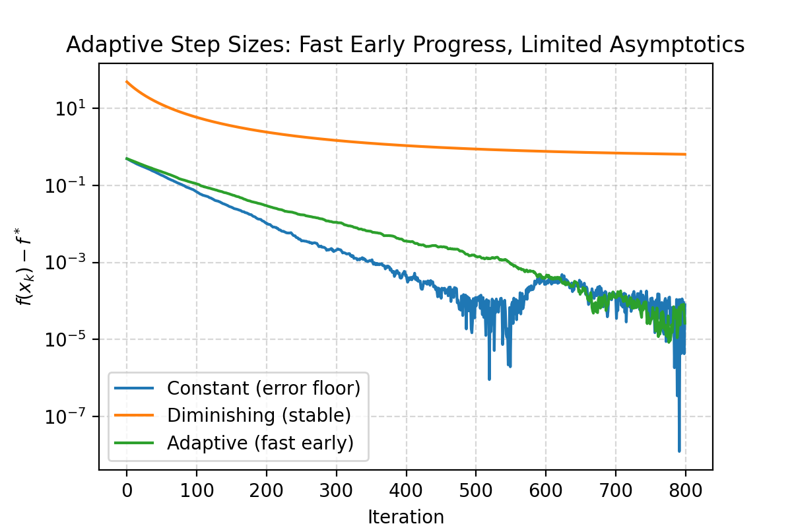

# Adaptive Step Size Strategies for Inexact First-Order Methods

 
*Figure 1: Comparison of optimization trajectories under persistently inexact gradients.*

## 📌 Project Overview
[cite_start]This project investigates the convergence behavior of **inexact first-order methods** under **strong convexity**[cite: 8]. [cite_start]In practical machine learning and large-scale optimization, exact gradient information is often unavailable due to numerical errors, truncation, or partial computations[cite: 6, 20].

[cite_start]We analyze how different step size strategies govern the trade-off between **descent progress** and **error accumulation**[cite: 32, 52]. [cite_start]This work provides both theoretical recursions and numerical validations of adaptive heuristics designed to mitigate error-induced stagnation[cite: 13, 56].

## 🚀 Key Research Questions
- [cite_start]**Can adaptive step sizes remove the error floor** without sacrificing efficiency? [cite: 416]
- [cite_start]How do step size choices govern convergence when gradients are **persistently inexact**? [cite: 418, 420]
- [cite_start]When do adaptive heuristics help, and where are their fundamental limits? [cite: 423]

## 🛠 Proposed Methods
[cite_start]We propose and compare two adaptive step size rules based on observable **gradient instability**[cite: 10, 102]:

1. [cite_start]**Method I: Continuous Scaling Rule** [cite: 103, 389]
   Adjusts the step size smoothly based on the magnitude of gradient discrepancy:
   [cite_start]$$\alpha_{k} = \text{clip}\left(\frac{c}{1+||g_k - g_{k-1}||}, \alpha_{min}, \alpha_{max}\right)$$ [cite: 104]

2. [cite_start]**Method II: Threshold-Based Switching Rule** [cite: 109, 392]
   [cite_start]Alternates between aggressive constant steps and conservative diminishing steps based on relative instability $\tau$[cite: 110, 114].

## 📊 Core Findings
[cite_start]Based on our convergence analysis and numerical experiments[cite: 63, 127]:
- [cite_start]**Constant Step Size**: Fast initial progress but converges only to a bounded **error neighborhood** (error floor)[cite: 146, 148].
- [cite_start]**Diminishing Step Size**: Ensures **exact convergence** by suppressing persistent errors, though it is often overly conservative[cite: 156, 157].
- [cite_start]**Adaptive Strategies**: Successfully **interpolate** between the two regimes—maintaining fast early progress while partially alleviating error-induced stagnation[cite: 12, 195, 325].

## 🧪 Experimental Scenarios
[cite_start]We demonstrate the utility of adaptive methods in several practical cases where problem constants are unknown[cite: 233, 237]:
- [cite_start]**Mis-specified Lipschitz Constants**: Adaptive rules alleviate excessive conservatism when $L$ is overestimated[cite: 238, 256].
- [cite_start]**Finite-Difference Gradients**: Handles deterministic errors introduced by numerical approximations[cite: 257, 277].

## 📂 Repository Structure
- [cite_start]`src/`: Core implementation of inexact gradient descent and adaptive rules[cite: 389, 393].
- [cite_start]`notebooks/`: Reproducible scripts for all figures in the report[cite: 63, 74].
- [cite_start]`docs/`: Includes the full 18-page technical report and the one-page visual summary[cite: 1, 415].

## ✍️ Author
**承軒 宋 (Cheng-Hsuan Sung)**
*Department of Mathematics, National Taiwan University*

---
**References**
- [1] Robbins, H., & Monro, S. (1951). [cite_start]A stochastic approximation method. [cite: 404]
- [2] Boyd, S., & Vandenberghe, L. (2004). [cite_start]Convex Optimization. [cite: 406]